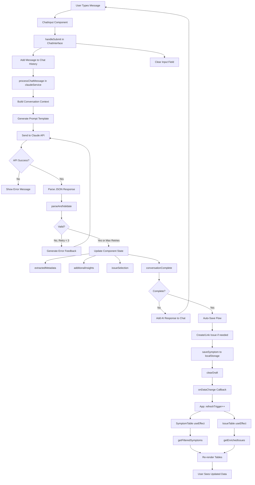
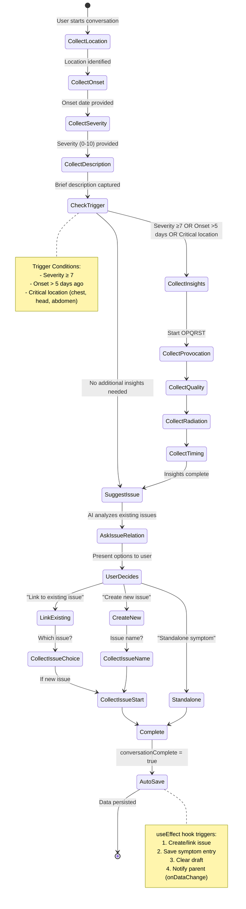
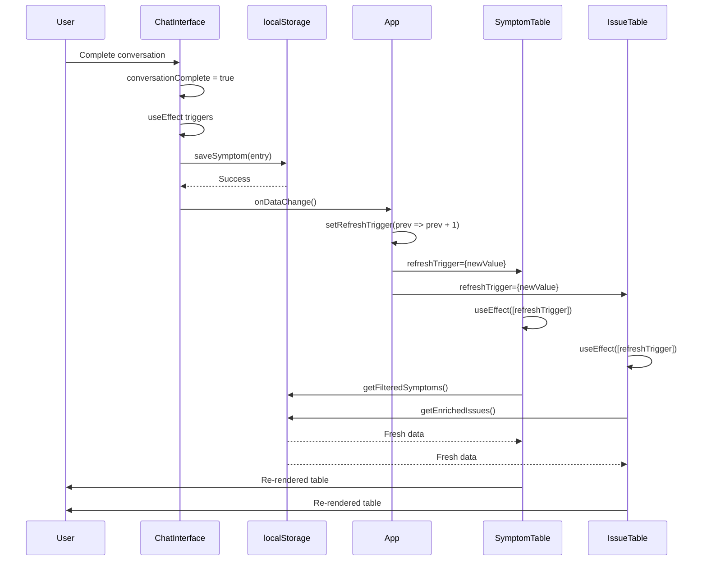
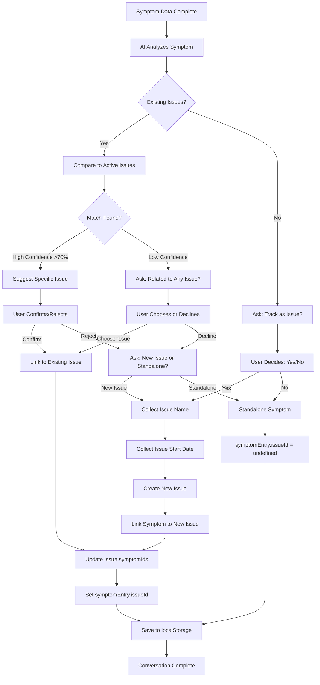
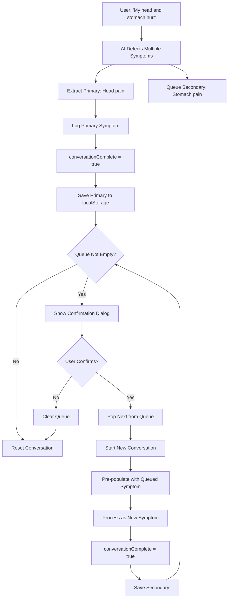
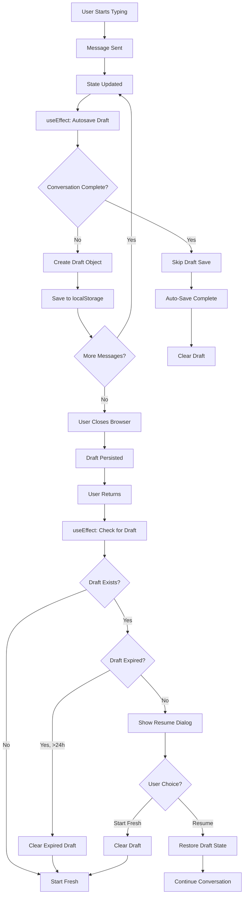
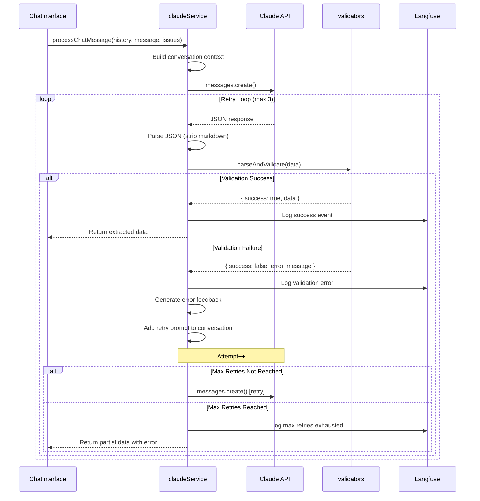

# Intelligent Symptom Tracking Application - Architecture Summary

## Executive Summary

The Intelligent Symptom Tracking application is a **conversational metadata extraction system** that transforms the tedious process of logging medical symptoms into a natural dialogue. Using Claude AI (Anthropic Sonnet 4.5), the application extracts structured health data through empathetic, multi-turn conversations while maintaining clinical rigor.

**Core Innovation:** Embedding structured data collection within conversational flow, making medical logging feel like talking to a friend while ensuring data quality through validation and retry mechanisms.

### Key Capabilities
- 🗣️ **Conversational Data Collection** - Natural language symptom logging
- 🔄 **Multi-Symptom Processing** - Intelligent detection and sequential logging
- 📊 **Issue Tracking** - Link symptoms to chronic/recurring health conditions
- 💾 **Auto-Save Drafts** - Prevents data loss with 24-hour draft persistence
- ✅ **Smart Validation** - Retry mechanism with AI feedback for data quality
- 📱 **Responsive Design** - Mobile-first with adaptive layouts

### Technology Stack
| Layer | Technology | Purpose |
|-------|-----------|---------|
| Frontend | React 18.2 + TypeScript 5.2 | Type-safe UI framework |
| Styling | Tailwind CSS 3.3 + shadcn/ui | Utility-first styling + accessible components |
| AI/NLP | Claude Sonnet 4.5 | Conversational metadata extraction |
| Storage | Browser localStorage | Client-side persistence |
| Observability | Langfuse 3.38 (optional) | Prompt tracking & cost monitoring |
| Build | Vite 5.0 | Fast dev server & bundling |

---

## System Architecture Overview

### High-Level Architecture

```
┌─────────────────────────────────────────────────────────────┐
│                      User Interface Layer                    │
│              (React + Tailwind + shadcn/ui)                  │
│                                                               │
│  ┌──────────────────┐  ┌──────────────────┐                │
│  │  ChatInterface   │  │  SymptomTable    │                │
│  │  (Conversation)  │  │  IssueTable      │                │
│  └──────────────────┘  └──────────────────┘                │
└─────────────────┬───────────────┬───────────────────────────┘
                  │               │
                  ↓               ↓
┌─────────────────────────────────────────────────────────────┐
│                   Application Logic Layer                    │
│                                                               │
│  ┌──────────────┐  ┌──────────────┐  ┌──────────────┐      │
│  │ claudeService│  │  validators  │  │ localStorage │      │
│  │ (API Client) │  │  (Schemas)   │  │ (Persistence)│      │
│  └──────────────┘  └──────────────┘  └──────────────┘      │
└────────┬──────────────────────────────────┬─────────────────┘
         │                                  │
         ↓                                  ↓
┌─────────────────┐              ┌──────────────────┐
│  Anthropic API  │              │   localStorage   │
│  (Claude 4.5)   │              │   (Browser)      │
└─────────────────┘              └──────────────────┘
         │
         ↓
┌─────────────────┐
│    Langfuse     │
│  (Optional)     │
└─────────────────┘
```

### Component Hierarchy

```
App.tsx (Root)
│
├── ChatInterface.tsx (Conversational UI)
│   │
│   ├── Message.tsx (Chat Bubbles)
│   │   └── User/Assistant message rendering
│   │
│   ├── ChatInput.tsx (Input Form)
│   │   └── Auto-focus, Enter-to-submit
│   │
│   └── Dialog (Resume Draft)
│       └── Draft resume confirmation
│
├── SymptomTable.tsx (Symptom Log)
│   │
│   ├── Pagination.tsx
│   ├── SymptomDetailsDialog.tsx (View Details)
│   └── DeleteConfirmDialog.tsx (Confirmation)
│
└── IssueTable.tsx (Health Issues)
    │
    ├── Pagination.tsx
    └── IssueDetailsDialog.tsx (View/Edit Issue)
```

---

## Complete Data Flow

### End-to-End User Journey



### Simplified Flow Diagram

```
┌─────────────┐
│ USER INPUT  │
└──────┬──────┘
       ↓
┌──────────────────────────────┐
│ ChatInterface State Manager  │
│ - Conversation history       │
│ - Metadata accumulation      │
│ - Draft auto-save           │
└──────────┬───────────────────┘
           ↓
┌──────────────────────────────┐
│ claudeService API Client     │
│ - Retry logic (max 3)       │
│ - Langfuse logging          │
└──────────┬───────────────────┘
           ↓
┌──────────────────────────────┐
│ Anthropic Claude API         │
│ - Conversational extraction  │
│ - JSON structured output     │
└──────────┬───────────────────┘
           ↓
┌──────────────────────────────┐
│ validators                   │
│ - Schema validation          │
│ - Controlled vocabularies    │
│ - Error feedback generation  │
└──────────┬───────────────────┘
           ↓
┌──────────────────────────────┐
│ ChatInterface (Accumulation) │
│ - Build complete data        │
│ - Trigger conditions check   │
└──────────┬───────────────────┘
           ↓
┌──────────────────────────────┐
│ localStorage Persistence     │
│ - Symptom entries            │
│ - Issue records              │
│ - Bidirectional links        │
└──────────┬───────────────────┘
           ↓
┌──────────────────────────────┐
│ onDataChange Callback        │
│ - Notify parent (App)        │
└──────────┬───────────────────┘
           ↓
┌──────────────────────────────┐
│ App: refreshTrigger++        │
│ - Increment counter          │
└──────────┬───────────────────┘
           ↓
┌──────────────────────────────┐
│ Tables: useEffect Re-fetch   │
│ - SymptomTable               │
│ - IssueTable                 │
└──────────┬───────────────────┘
           ↓
┌──────────────────────────────┐
│ UI UPDATE - User sees data   │
└──────────────────────────────┘
```

---

## Conversation State Machine

The conversation follows a state machine that progressively builds complete symptom data:



### State Accumulation Pattern

```typescript
// ChatInterface maintains conversation state
const [extractedMetadata, setExtractedMetadata] = useState<SymptomMetadata | null>(null);
const [additionalInsights, setAdditionalInsights] = useState<AdditionalInsights>({});
const [issueSelection, setIssueSelection] = useState<IssueSelection | null>(null);
const [conversationComplete, setConversationComplete] = useState(false);

// Each turn updates state incrementally
// Turn 1: { location: "head", onset: null, severity: null, description: null }
// Turn 2: { location: "head", onset: "2025-12-05", severity: null, description: null }
// Turn 3: { location: "head", onset: "2025-12-05", severity: 8, description: "throbbing headache" }
// Turn 4: { location: "head", onset: "2025-12-05", severity: 8, description: "throbbing headache" }
//         + additionalInsights: { quality: "throbbing", provocation: "worse with light" }
// Turn 5: conversationComplete = true → Auto-save triggers
```

---

## Component Communication Pattern

### Refresh Trigger Pattern



### Props and Callbacks

```typescript
// Parent (App.tsx)
const [refreshTrigger, setRefreshTrigger] = useState(0);

const handleDataChange = () => {
  setRefreshTrigger(prev => prev + 1); // Increment triggers child re-fetch
};

<ChatInterface onDataChange={handleDataChange} />
<SymptomTable refreshTrigger={refreshTrigger} />
<IssueTable refreshTrigger={refreshTrigger} />

// Child (ChatInterface.tsx)
interface ChatInterfaceProps {
  onDataChange?: () => void; // Callback to parent
}

// After saving symptom
onDataChange?.(); // Notify parent

// Children (Tables)
useEffect(() => {
  loadSymptoms(); // Re-fetch when refreshTrigger changes
}, [refreshTrigger]);
```

---

## Issue Linking Workflow



### Bidirectional Relationship

```typescript
// When linking symptom to issue
interface SymptomEntry {
  id: string;
  issueId?: string; // ← Points to Issue
  // ... other fields
}

interface Issue {
  id: string;
  symptomIds: string[]; // ← Points to SymptomEntries
  // ... other fields
}

// linkSymptomToIssue maintains both sides
function linkSymptomToIssue(symptomId: string, issueId: string) {
  // 1. Update symptom.issueId
  symptom.issueId = issueId;

  // 2. Add to issue.symptomIds (if not already present)
  if (!issue.symptomIds.includes(symptomId)) {
    issue.symptomIds.push(symptomId);
  }

  // 3. Save both
  saveSymptom(symptom);
  saveIssue(issue);
}
```

---

## Multi-Symptom Queue Processing



### Queue State Management

```typescript
// ChatInterface state
const [queuedSymptoms, setQueuedSymptoms] = useState<string[]>([]);

// AI response can include queued symptoms
interface ExtractionResponse {
  queuedSymptoms?: string[]; // e.g., ["stomach pain", "knee ache"]
  // ... other fields
}

// After successful save
if (queuedSymptoms.length > 0) {
  const nextSymptom = queuedSymptoms[0];
  const confirmed = window.confirm(
    `You also mentioned: "${nextSymptom}"\n\nWould you like to log that symptom now?`
  );

  if (confirmed) {
    // Remove from queue
    setQueuedSymptoms(queuedSymptoms.slice(1));

    // Start new conversation with queued symptom
    processChatMessage([], nextSymptom, issues);
  }
}
```

---

## Draft Auto-Save Flow



### Draft Data Structure

```typescript
interface ConversationDraft {
  messages: ChatMessage[];
  extractedMetadata: SymptomMetadata | null;
  additionalInsights: AdditionalInsights;
  queuedSymptoms: string[];
  suggestedIssue: SuggestedIssue | null;
  issueSelection: IssueSelection | null;
  conversationComplete: boolean;
  timestamp: Date; // For expiry check
}

// Auto-save on state change
useEffect(() => {
  if (messages.length > 0 && !conversationComplete) {
    const draft: ConversationDraft = {
      messages,
      extractedMetadata,
      additionalInsights,
      queuedSymptoms,
      suggestedIssue,
      issueSelection,
      conversationComplete,
      timestamp: new Date(),
    };
    saveDraft(draft);
  }
}, [messages, extractedMetadata, additionalInsights, /* ... all state */]);

// Check for draft on mount
useEffect(() => {
  const draft = getDraft();
  if (draft && !isDraftExpired(draft)) {
    setPendingDraft(draft);
    setShowResumeDialog(true);
  } else if (draft && isDraftExpired(draft)) {
    clearDraft();
  }
}, []);
```

---

## Validation and Retry Mechanism



### Validation Rules

```typescript
// validators.ts
export function parseAndValidate(data: unknown): ValidationResult {
  // 1. Check JSON structure
  if (!data || typeof data !== 'object' || !('metadata' in data)) {
    return { success: false, error: 'Missing metadata object' };
  }

  // 2. Validate location (allow null during conversation)
  if (metadata.location !== null && !isValidLocation(metadata.location)) {
    return {
      success: false,
      error: 'Invalid location',
      message: `Location must be one of: ${CONTROLLED_VOCABULARIES.location.join(', ')}`
    };
  }

  // 3. Validate severity (0-10 integer or null)
  if (metadata.severity !== null && !isValidSeverity(metadata.severity)) {
    return {
      success: false,
      error: 'Invalid severity',
      message: 'Severity must be an integer between 0-10'
    };
  }

  // 4. Validate onset (ISO date, not future, or null)
  if (metadata.onset !== null && !isValidOnsetDate(metadata.onset)) {
    return {
      success: false,
      error: 'Invalid onset date',
      message: 'Onset must be ISO date (YYYY-MM-DD) and not in the future'
    };
  }

  return { success: true, data: metadata };
}
```

---

## Core Components Deep Dive

### 1. App.tsx (Root Component)

**File:** `src/App.tsx`

**Responsibilities:**
- Root component layout
- Refresh trigger state management
- Coordinate data updates between ChatInterface and Tables

**State:**
```typescript
const [refreshTrigger, setRefreshTrigger] = useState(0);
```

**Key Pattern:**
```typescript
const handleDataChange = () => {
  setRefreshTrigger(prev => prev + 1); // Increment triggers useEffect in children
};

// Two-column responsive layout
<div className="grid grid-cols-1 lg:grid-cols-2 gap-4 sm:gap-6 md:gap-8 lg:gap-10">
  <ChatInterface onDataChange={handleDataChange} />
  <div className="space-y-4 sm:space-y-6 md:space-y-8">
    <SymptomTable refreshTrigger={refreshTrigger} />
    <IssueTable refreshTrigger={refreshTrigger} />
  </div>
</div>
```

---

### 2. ChatInterface.tsx (Conversation Orchestrator)

**File:** `src/ChatInterface.tsx`

**Responsibilities:**
- Conversation state management (16+ state variables)
- Message history tracking
- Auto-save draft functionality
- Multi-symptom queue processing
- Issue relationship conversation flow
- Success/error message handling

**State Variables:**
```typescript
// Message state
const [messages, setMessages] = useState<ChatMessage[]>([]);
const [input, setInput] = useState('');
const [loading, setLoading] = useState(false);
const [error, setError] = useState<string | null>(null);

// Extraction state
const [extractedMetadata, setExtractedMetadata] = useState<SymptomMetadata | null>(null);
const [additionalInsights, setAdditionalInsights] = useState<AdditionalInsights>({});
const [conversationComplete, setConversationComplete] = useState(false);

// Multi-symptom queue
const [queuedSymptoms, setQueuedSymptoms] = useState<string[]>([]);

// Issue tracking
const [issues, setIssues] = useState<EnrichedIssue[]>([]);
const [issueSelection, setIssueSelection] = useState<IssueSelection | null>(null);
const [suggestedIssue, setSuggestedIssue] = useState<SuggestedIssue | null>(null);

// Draft/resume
const [showResumeDialog, setShowResumeDialog] = useState(false);
const [pendingDraft, setPendingDraft] = useState<ConversationDraft | null>(null);

// Success message
const [successMessage, setSuccessMessage] = useState<string | null>(null);
```

**Auto-Save Logic:**
```typescript
// Auto-save when conversation is complete
useEffect(() => {
  if (!conversationComplete || !extractedMetadata) return;

  const saveSymptomEntry = async () => {
    // 1. Handle issue selection
    let finalIssueId: string | undefined;

    if (issueSelection?.type === 'new') {
      const newIssue = { /* create issue */ };
      saveIssue(newIssue);
      finalIssueId = newIssue.id;
    } else if (issueSelection?.type === 'existing') {
      // Map issue name to UUID
      finalIssueId = matchedIssue.id;
    }

    // 2. Save symptom
    const symptomEntry: SymptomEntry = {
      id: generateUUID(),
      timestamp: new Date(),
      metadata: extractedMetadata,
      additionalInsights,
      conversationHistory: messages.map(m => m.content),
      issueId: finalIssueId,
    };

    saveSymptom(symptomEntry);
    clearDraft();

    // 3. Notify parent
    onDataChange?.();

    // 4. Show success and reset
    setSuccessMessage('Symptom logged successfully!');
    setTimeout(handleReset, 2000);
  };

  saveSymptomEntry();
}, [conversationComplete, extractedMetadata, issueSelection]);
```

---

### 3. SymptomTable.tsx (Symptom Log Display)

**File:** `src/components/SymptomTable.tsx`

**Responsibilities:**
- Paginated symptom log display (10 per page)
- Advanced filtering (location, severity range, issue, date range, search)
- Responsive design (table on desktop ≥768px, cards on mobile)
- Symptom detail viewing
- Symptom deletion with confirmation

**Filtering Logic:**
```typescript
interface SymptomFilterOptions {
  page?: number;
  limit?: number;
  location?: Location;
  severityMin?: number;
  severityMax?: number;
  startDate?: string;
  endDate?: string;
  searchQuery?: string;
  issueId?: string | null; // null = "no issue", undefined = "all"
}

// Load symptoms when filters or refreshTrigger change
useEffect(() => {
  const result = getFilteredSymptoms(filters);
  setSymptoms(result.symptoms);
  setTotal(result.total);
}, [filters, refreshTrigger]);
```

**Responsive Layout:**
```tsx
{/* Desktop Table - hidden on mobile */}
<div className="hidden md:block">
  <div className="grid grid-cols-6 gap-3">
    {/* Column headers and data rows */}
  </div>
</div>

{/* Mobile Cards - visible on mobile only */}
<div className="md:hidden divide-y">
  {symptoms.map(symptom => (
    <div className="p-3 space-y-2">
      {/* Card layout with stacked info */}
    </div>
  ))}
</div>
```

---

### 4. IssueTable.tsx (Health Issues Display)

**File:** `src/components/IssueTable.tsx`

**Responsibilities:**
- Issue list display with enriched data
- Filtering (search by name, status: active/resolved)
- Issue statistics (entry count, avg severity, last entry)
- Issue detail viewing and editing
- Responsive card/table layout

**Enriched Data:**
```typescript
interface EnrichedIssue extends Issue {
  lastEntry?: {
    date: string;
    daysAgo: number;
    severity: number;
  };
}

// Enrichment happens in localStorage.ts
export function getEnrichedIssues(status?: 'active' | 'resolved'): EnrichedIssue[] {
  let issues = getIssues(status);

  return issues.map(issue => {
    const symptoms = getSymptoms(issue.id);

    if (symptoms.length === 0) return { ...issue };

    // Sort by timestamp descending
    const sorted = symptoms.sort((a, b) => b.timestamp.getTime() - a.timestamp.getTime());
    const latest = sorted[0];

    return {
      ...issue,
      lastEntry: {
        date: latest.timestamp.toISOString(),
        daysAgo: Math.floor((Date.now() - latest.timestamp.getTime()) / (1000 * 60 * 60 * 24)),
        severity: latest.metadata.severity,
      },
    };
  });
}
```

---

### 5. ChatInput.tsx (Input Component)

**File:** `src/components/ChatInput.tsx`

**Responsibilities:**
- User input capture
- Enter-to-submit functionality
- Auto-focus after message sent
- Disabled state during API calls

**Auto-Focus Logic:**
```typescript
const inputRef = useRef<HTMLInputElement>(null);

// Focus input when value is cleared (after submission)
useEffect(() => {
  if (value === '' && !disabled && autoFocus) {
    inputRef.current?.focus();
  }
}, [value, disabled, autoFocus]);

// Enter key handling
const handleKeyDown = (e: KeyboardEvent<HTMLInputElement>) => {
  if (e.key === 'Enter' && !e.shiftKey) {
    e.preventDefault();
    if (value.trim() && !disabled) {
      onSubmit(e as unknown as FormEvent);
    }
  }
};
```

---

## Service Layer

### 1. claudeService.ts (API Client)

**File:** `src/claudeService.ts`

**Core Function:**
```typescript
export async function processChatMessage(
  conversationHistory: ConversationMessage[],
  userMessage: string,
  activeIssues: EnrichedIssue[] = [],
  maxRetries: number = 3
): Promise<ConversationResult>
```

**Flow:**
1. Build conversation context with system prompt
2. Send to Claude API (Sonnet 4.5)
3. Parse JSON response (strip markdown code blocks)
4. Validate with `parseAndValidate()`
5. If invalid: retry with error feedback (max 3 attempts)
6. Log to Langfuse for observability
7. Return structured data

**API Configuration:**
```typescript
const client = new Anthropic({
  apiKey: import.meta.env.VITE_ANTHROPIC_API_KEY,
  dangerouslyAllowBrowser: true, // NOTE: Use backend proxy in production
});

const response = await client.messages.create({
  model: 'claude-sonnet-4-20250514',
  max_tokens: 2048,
  messages: conversationMessages,
});
```

---

### 2. localStorage.ts (Persistence Layer)

**File:** `src/localStorage.ts`

**Storage Keys:**
- `symptom_logger_data` - Main data store
- `symptom_logger_draft` - Draft conversation

**Data Structure:**
```typescript
interface StorageData {
  symptoms: SymptomEntry[];
  issues: Issue[];
}
```

**Core Functions:**

**Symptom Management:**
```typescript
saveSymptom(entry: SymptomEntry): void
getSymptoms(issueId?: string): SymptomEntry[]
deleteSymptom(id: string): void
getFilteredSymptoms(options: SymptomFilterOptions): { symptoms, total }
```

**Issue Management:**
```typescript
saveIssue(issue: Issue): void
getIssues(status?: 'active' | 'resolved'): Issue[]
updateIssue(id: string, updates: Partial<Issue>): void
deleteIssue(id: string): void
resolveIssue(issueId: string, endDate: string): void
getEnrichedIssues(status?: 'active' | 'resolved'): EnrichedIssue[]
```

**Relationship Management:**
```typescript
linkSymptomToIssue(symptomId: string, issueId: string): void
unlinkSymptomFromIssue(symptomId: string): void
```

**Draft Management:**
```typescript
saveDraft(draft: ConversationDraft): void
getDraft(): ConversationDraft | null
clearDraft(): void
isDraftExpired(draft: ConversationDraft): boolean
```

---

### 3. validators.ts (Schema Validation)

**File:** `src/validators.ts`

**Functions:**
```typescript
isValidLocation(location: string): boolean
isValidSeverity(severity: number): boolean
isValidOnsetDate(date: string): boolean
parseAndValidate(data: unknown): ValidationResult
generateErrorFeedback(result: ValidationResult): string
```

**Validation Strategy:**
- Allow `null` values during conversation (partial data)
- Strict validation for controlled vocabularies
- Detailed error messages for AI retry feedback

---

### 4. promptTemplates.ts (Prompt Engineering)

**File:** `src/promptTemplates.ts`

**Key Templates:**

**1. Conversational Prompt:**
```typescript
export function getConversationalPrompt(activeIssues: EnrichedIssue[] = []): string
```

Instructs Claude to:
- Gather required metadata (location, onset, severity, description)
- Collect additional insights if triggered (severity ≥7, onset >5 days, critical location)
- Handle issue tracking (suggest matches, ask user)
- Detect multi-symptom scenarios
- Maintain conversational flow (one question at a time)

**2. Controlled Vocabularies:**
```typescript
export const CONTROLLED_VOCABULARIES = {
  location: [
    'head', 'neck', 'throat', 'jaw', 'ear', 'eye',
    'chest', 'upper_back', 'lower_back', 'abdomen',
    'shoulder', 'arm', 'elbow', 'wrist', 'hand',
    'hip', 'leg', 'knee', 'ankle', 'foot', 'other'
  ],
  severity: '0-10 scale (0 = no pain, 10 = worst imaginable pain)',
};
```

**3. Response Format:**
```typescript
{
  "metadata": {
    "location": "head" | "chest" | ... | null,
    "onset": "YYYY-MM-DD" | null,
    "severity": 0-10 | null,
    "description": "string" | null
  },
  "additionalInsights": {
    "provocation": "string" | null,
    "quality": "string" | null,
    "radiation": "string" | null,
    "timing": "string" | null
  },
  "issueSelection": {
    "type": "existing" | "new" | "none",
    "existingIssueId": "string",
    "newIssueName": "string",
    "newIssueStartDate": "YYYY-MM-DD"
  } | null,
  "suggestedIssue": {
    "isRelated": boolean,
    "existingIssueId": "string" | null,
    "newIssueName": "string" | null,
    "confidence": 0.0-1.0
  },
  "queuedSymptoms": ["symptom 1", "symptom 2"],
  "aiMessage": "conversational response",
  "conversationComplete": boolean
}
```

---

### 5. langfuse.ts (Observability)

**File:** `src/langfuse.ts`

**Purpose:** Track AI interactions, token usage, costs, and validation errors

**What It Tracks:**

**1. Traces:** Each conversation turn
```typescript
const trace = createTrace({
  name: 'symptom-extraction',
  userId: null,
  metadata: {
    conversationTurn: messages.length,
    activeIssuesCount: activeIssues.length,
    userMessage: userMessage,
  },
});
```

**2. Generations:** Each Claude API call
```typescript
const generation = createGeneration({
  name: `symptom-extraction-attempt-${attemptNumber}`,
  model: 'claude-sonnet-4-20250514',
  input: conversationMessages,
  output: responseText,
  usage: {
    input: inputTokens,
    output: outputTokens,
    total: totalTokens,
  },
  metadata: {
    latencyMs: endTime - startTime,
    cost: calculateCost(model, inputTokens, outputTokens),
  },
});
```

**3. Events:** Validation errors, retries
```typescript
logEvent({
  trace,
  name: 'validation-error',
  level: 'ERROR',
  metadata: {
    error: validationResult.error,
    attemptNumber,
  },
});
```

**Cost Calculation:**
```typescript
const CLAUDE_PRICING = {
  'claude-sonnet-4-20250514': {
    input: 3.0,   // $3 per 1M tokens
    output: 15.0, // $15 per 1M tokens
  },
};

function calculateCost(model: string, inputTokens: number, outputTokens: number): number {
  const inputCost = (inputTokens / 1_000_000) * 3.0;
  const outputCost = (outputTokens / 1_000_000) * 15.0;
  return inputCost + outputCost;
}
```

---

## Type System

**File:** `src/types.ts`

### Core Types

**Location Enum:**
```typescript
export enum Location {
  HEAD = 'head',
  NECK = 'neck',
  THROAT = 'throat',
  JAW = 'jaw',
  EAR = 'ear',
  EYE = 'eye',
  CHEST = 'chest',
  UPPER_BACK = 'upper_back',
  LOWER_BACK = 'lower_back',
  ABDOMEN = 'abdomen',
  SHOULDER = 'shoulder',
  ARM = 'arm',
  ELBOW = 'elbow',
  WRIST = 'wrist',
  HAND = 'hand',
  HIP = 'hip',
  LEG = 'leg',
  KNEE = 'knee',
  ANKLE = 'ankle',
  FOOT = 'foot',
  OTHER = 'other',
}
```

**Severity Type:**
```typescript
export type Severity = number; // 0-10 integer
```

**SymptomMetadata:**
```typescript
export interface SymptomMetadata {
  location: Location;
  onset: string; // ISO date (YYYY-MM-DD)
  severity: Severity; // 0-10
  description?: string;
}
```

**AdditionalInsights (OPQRST):**
```typescript
export interface AdditionalInsights {
  provocation?: string; // What makes it better/worse
  quality?: string; // Sharp, dull, throbbing, etc.
  radiation?: string; // Does it spread?
  timing?: string; // Constant or intermittent
}
```

**Issue:**
```typescript
export interface Issue {
  id: string; // UUID
  name: string; // e.g., "Chronic migraines"
  status: 'active' | 'resolved';
  startDate: string; // ISO date (YYYY-MM-DD)
  endDate?: string; // ISO date when resolved
  createdAt: Date;
  symptomIds: string[]; // References to SymptomEntry IDs
}
```

**SymptomEntry:**
```typescript
export interface SymptomEntry {
  id: string; // UUID
  timestamp: Date; // When logged
  metadata: SymptomMetadata;
  additionalInsights?: AdditionalInsights;
  conversationHistory?: string[]; // Full chat for context
  issueId?: string; // Link to parent issue
}
```

**IssueSelection:**
```typescript
export interface IssueSelection {
  type: 'existing' | 'new' | 'none';
  existingIssueId?: string; // For type='existing' (issue name, mapped to UUID)
  newIssueName?: string; // For type='new'
  newIssueStartDate?: string; // For type='new' (ISO date)
}
```

**SuggestedIssue:**
```typescript
export interface SuggestedIssue {
  isRelated: boolean;
  existingIssueId?: string; // If matched to existing (issue name)
  newIssueName?: string; // If suggesting new issue
  confidence: number; // 0-1 confidence score
}
```

**ExtractionResponse:**
```typescript
export interface ExtractionResponse {
  metadata: SymptomMetadata;
  additionalInsights?: AdditionalInsights;
  aiMessage?: string;
  conversationComplete?: boolean;
  suggestedIssue?: SuggestedIssue;
  queuedSymptoms?: string[];
  issueSelection?: IssueSelection;
}
```

---

## State Management

### Local Component State (React Hooks)

**No global state library used.** The application relies on:

1. **useState hooks** in components
2. **Prop drilling** for parent-child communication
3. **Callback pattern** for child-to-parent updates
4. **localStorage** as persistent state

### State Flow Diagram

```
┌────────────────────────────────────────┐
│         Browser localStorage           │
│  (Single Source of Truth for Data)    │
└───────────────┬────────────────────────┘
                │
                ↓
┌────────────────────────────────────────┐
│         App.tsx (Root State)           │
│  - refreshTrigger: number              │
└───────┬────────────────────────────────┘
        │
        ├──────────────────┬──────────────────┐
        ↓                  ↓                  ↓
┌───────────────┐  ┌──────────────┐  ┌──────────────┐
│ChatInterface  │  │SymptomTable  │  │ IssueTable   │
│               │  │              │  │              │
│16+ state vars │  │Filter state  │  │Filter state  │
│- messages     │  │- filters     │  │- searchQuery │
│- metadata     │  │- currentPage │  │- statusFilter│
│- insights     │  │- symptoms    │  │- issues      │
│- queue        │  └──────────────┘  └──────────────┘
│- issues       │
│- draft        │
└───────────────┘
```

### Refresh Trigger Pattern

```typescript
// Parent (App.tsx)
const [refreshTrigger, setRefreshTrigger] = useState(0);

const handleDataChange = () => {
  setRefreshTrigger(prev => prev + 1);
};

// Child (ChatInterface.tsx)
onDataChange?.(); // Triggers parent increment

// Children (Tables)
useEffect(() => {
  loadData(); // Re-fetch when refreshTrigger changes
}, [refreshTrigger]);
```

**Why This Pattern?**
- Simple and predictable
- No prop drilling for data
- Tables remain decoupled from ChatInterface
- Each table can independently fetch fresh data
- Easy to debug (just increment a number)

---

## Integration Points

### 1. Anthropic Claude API

**Endpoint:** `https://api.anthropic.com/v1/messages`

**Configuration:**
```typescript
import Anthropic from '@anthropic-ai/sdk';

const client = new Anthropic({
  apiKey: import.meta.env.VITE_ANTHROPIC_API_KEY,
  dangerouslyAllowBrowser: true, // ⚠️ Backend proxy recommended for production
});

const response = await client.messages.create({
  model: 'claude-sonnet-4-20250514',
  max_tokens: 2048,
  messages: conversationMessages,
});
```

**Request Format:**
```typescript
[
  {
    role: 'user',
    content: 'System prompt with controlled vocabularies and examples'
  },
  {
    role: 'user',
    content: 'I have a severe headache'
  },
  {
    role: 'assistant',
    content: '{"metadata": {...}, "aiMessage": "...", ...}'
  },
  // ... conversation history
]
```

**Response Handling:**
```typescript
const responseText = response.content[0].text;

// Strip markdown code blocks if present
const cleaned = responseText.replace(/```json\n?/g, '').replace(/```\n?/g, '');

// Parse JSON
const parsed = JSON.parse(cleaned);

// Validate
const validationResult = parseAndValidate(parsed);
```

---

### 2. Langfuse (Optional Observability)

**Configuration:**
```typescript
// .env.local
VITE_LANGFUSE_PUBLIC_KEY=pk-...
VITE_LANGFUSE_SECRET_KEY=sk-...
VITE_LANGFUSE_HOST=https://cloud.langfuse.com
VITE_ENVIRONMENT=development
```

**Integration Points:**
- Trace creation per conversation turn
- Generation logging per API call
- Event logging for errors and retries
- Cost calculation and tracking

**Graceful Degradation:**
```typescript
// If Langfuse not configured, log operations become no-ops
if (!apiKey || !secretKey) {
  return null; // Skip logging
}
```

---

### 3. Browser localStorage

**Storage Schema:**
```typescript
{
  "symptom_logger_data": {
    "symptoms": [
      {
        "id": "uuid-1",
        "timestamp": "2025-12-05T12:00:00.000Z",
        "metadata": { "location": "head", "onset": "2025-12-05", "severity": 8, "description": "..." },
        "additionalInsights": { "quality": "throbbing", "provocation": "worse with light" },
        "conversationHistory": ["...", "..."],
        "issueId": "issue-uuid-1"
      }
    ],
    "issues": [
      {
        "id": "issue-uuid-1",
        "name": "Chronic migraines",
        "status": "active",
        "startDate": "2025-10-15",
        "createdAt": "2025-11-01T10:00:00.000Z",
        "symptomIds": ["uuid-1", "uuid-2"]
      }
    ]
  },
  "symptom_logger_draft": {
    "messages": [...],
    "extractedMetadata": {...},
    "timestamp": "2025-12-05T14:30:00.000Z"
  }
}
```

**Date Serialization:**
```typescript
// Save
JSON.stringify(data, (key, value) =>
  value instanceof Date ? value.toISOString() : value
);

// Load
JSON.parse(stored, (key, value) =>
  /^\d{4}-\d{2}-\d{2}T\d{2}:\d{2}:\d{2}.\d{3}Z$/.test(value)
    ? new Date(value)
    : value
);
```

---

## Key Design Patterns

### 1. Conversational Metadata Extraction

**Pattern:** Multi-turn dialogue progressively builds complete data structure

**Benefits:**
- Natural user experience
- High data quality (validated at each step)
- Flexible conversation flow (AI adapts to user input)

**Implementation:**
- State accumulation in ChatInterface
- Null-safe validation during conversation
- Completion flag triggers auto-save

---

### 2. Retry with AI Feedback

**Pattern:** Validation errors are fed back to AI for self-correction

**Benefits:**
- High success rate (Claude corrects its own mistakes)
- Graceful degradation (max 3 retries)
- Detailed error tracking via Langfuse

**Implementation:**
```typescript
for (let attempt = 1; attempt <= maxRetries; attempt++) {
  const response = await callAPI();
  const validationResult = parseAndValidate(response);

  if (validationResult.success) {
    return validationResult.data;
  }

  // Add error feedback to conversation
  messages.push({
    role: 'user',
    content: RETRY_PROMPT(generateErrorFeedback(validationResult))
  });
}
```

---

### 3. Draft Auto-Save with Expiry

**Pattern:** Every state change saves draft; 24-hour expiry prevents clutter

**Benefits:**
- Prevents data loss on accidental close
- Resume seamless experience
- No stale drafts accumulating

**Implementation:**
- `useEffect` on all state changes
- Timestamp-based expiry check
- Resume dialog on mount

---

### 4. Bidirectional Relationships

**Pattern:** Symptom ↔ Issue links maintained on both sides

**Benefits:**
- Fast lookup in either direction
- Referential integrity
- Easy querying (e.g., "all symptoms for issue X")

**Implementation:**
```typescript
// Symptom → Issue
symptom.issueId = issueId;

// Issue → Symptoms
issue.symptomIds.push(symptomId);

// Both saved atomically
```

---

### 5. Responsive Component Pattern

**Pattern:** Single component, dual rendering paths based on breakpoint

**Benefits:**
- Shared logic and state
- No code duplication
- Consistent behavior

**Implementation:**
```tsx
{/* Desktop: Table layout */}
<div className="hidden md:block">
  {/* Grid with 6 columns */}
</div>

{/* Mobile: Card layout */}
<div className="md:hidden">
  {/* Stacked card design */}
</div>
```

---

### 6. Refresh Trigger Coordination

**Pattern:** Increment counter to trigger child re-fetch

**Benefits:**
- Decouples components
- Simple and predictable
- Easy to debug

**Implementation:**
```typescript
// Parent
const [refreshTrigger, setRefreshTrigger] = useState(0);
const handleDataChange = () => setRefreshTrigger(prev => prev + 1);

// Child
useEffect(() => {
  loadData();
}, [refreshTrigger]);
```

---

## Security and Privacy Considerations

### Current Implementation

**⚠️ Development Configuration:**
- API key exposed in browser (`dangerouslyAllowBrowser: true`)
- All data stored in localStorage (not encrypted)
- No authentication or authorization
- Langfuse may store PHI (Protected Health Information)

### Recommended Production Architecture

```
┌────────────┐         ┌────────────┐         ┌────────────┐
│  Browser   │  HTTPS  │   Backend  │  HTTPS  │  Claude    │
│  (React)   ├────────►│   Proxy    ├────────►│  API       │
│            │         │  (Node.js) │         │            │
└────────────┘         └────────────┘         └────────────┘
                             │
                             ↓
                       ┌────────────┐
                       │  Database  │
                       │  (Postgres)│
                       └────────────┘
```

**Production Checklist:**
- [ ] Backend API proxy (hide API keys)
- [ ] Database storage (encrypted at rest)
- [ ] User authentication (Auth0, Firebase)
- [ ] Rate limiting
- [ ] HTTPS only
- [ ] Business Associate Agreement with Anthropic (HIPAA)
- [ ] Audit logging
- [ ] Data retention policies
- [ ] Incident response procedures

---

## Performance Considerations

### Token Usage Optimization

**Current:** Full conversation history sent on each turn

**Optimization Opportunities:**
1. Truncate history after 10 turns (keep only recent context)
2. Summarize early turns instead of full text
3. Use Claude Haiku for simple validations

### Caching Opportunities

**Static Components:**
- System prompt (changes infrequently)
- Controlled vocabularies (never change)
- Active issues (updated rarely)

**Potential:** Anthropic's prompt caching (reduces cost & latency)

### LocalStorage Performance

**Current:** Simple JSON serialization (works fine for 100s-1000s entries)

**Future:** IndexedDB for larger datasets (10,000+ symptoms)

---

## Error Handling Strategy

### 1. API Errors
```typescript
try {
  const response = await client.messages.create({...});
} catch (error) {
  setError('Failed to connect to AI service. Please try again.');
  logEvent({ name: 'api-error', level: 'ERROR', metadata: { error } });
}
```

### 2. Validation Errors
```typescript
if (!validationResult.success) {
  if (attempt < maxRetries) {
    messages.push({ role: 'user', content: RETRY_PROMPT(error) });
    continue; // Retry
  } else {
    logEvent({ name: 'max-retries-exhausted', level: 'ERROR' });
    return partialData; // Graceful degradation
  }
}
```

### 3. Storage Errors
```typescript
try {
  localStorage.setItem(STORAGE_KEY, JSON.stringify(data));
} catch (error) {
  console.error('Failed to save to localStorage:', error);
  alert('Storage quota exceeded. Please clear old data.');
}
```

---

## Future Enhancements

### 1. Backend & Database
- Move API key to backend proxy
- PostgreSQL for data storage
- User authentication & authorization
- API rate limiting

### 2. Data Export
- PDF export for doctor visits
- CSV export for analysis
- Integration with Apple Health, Google Fit

### 3. Visualizations
- Symptom timeline chart
- Severity trends over time
- Body location heatmap
- Issue progression graphs

### 4. Advanced AI Features
- Pattern detection ("headaches occur every Monday")
- Trigger identification ("symptoms correlate with stress")
- Medication tracking integration
- Emergency detection (auto-suggest 911)

### 5. Mobile App
- React Native version
- Push notifications for logging reminders
- Camera integration (visual symptoms)
- Offline support with sync

---

## Conclusion

The Intelligent Symptom Tracking application demonstrates how carefully engineered prompts and validation can transform tedious data entry into natural conversation. By combining Claude's language understanding with structured validation, multi-turn state management, and thoughtful UX design, the system achieves the rare combination of medical rigor and patient-friendly interaction.

**Key Innovations:**
- Conversational metadata extraction with clinical precision
- Incremental state building through multi-turn dialogue
- Intelligent issue tracking for chronic conditions
- Multi-symptom queue for complex inputs
- Draft autosave with seamless resume
- Validation retry with AI feedback loop

**Technical Excellence:**
- Type-safe TypeScript throughout
- Clean component architecture
- Zero-latency localStorage persistence
- Responsive mobile-first design
- Optional observability with Langfuse
- Graceful error handling

This architecture serves as a reference implementation for conversational data extraction systems in healthcare and beyond.
